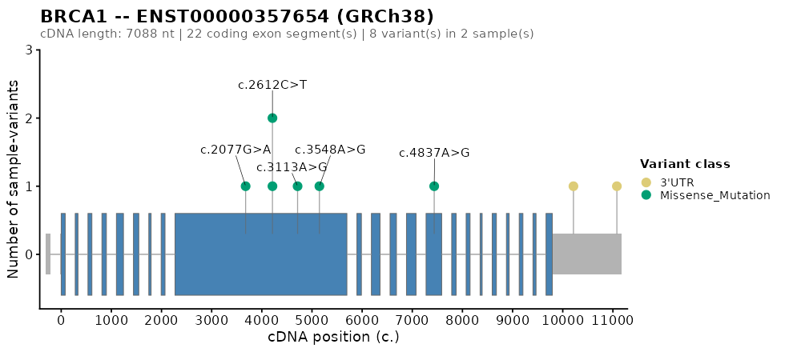

<!-- README.md is generated from README.Rmd. Please edit that file. -->

```{r, include = FALSE}
knitr::opts_chunk$set(
  collapse = TRUE,
  comment  = "#>",
  fig.path = "man/figures/README-",
  out.width = "100%"
)
```

# germlinevaR 

<!-- badges: start -->
[](https://lifecycle.r-lib.org/articles/stages.html#stable)
[](https://CRAN.R-project.org/package=germlinevaR)
<!-- badges: end -->

A self-contained toolchain for single-sample germline VCFs annotated with
Ensembl VEP, SnpEff, or both — from on-disk VCF to filtered MAF, candidate
novel variants, cohort summary, a top-genes variant matrix, and per-gene protein-domain
lollipops, all in one R session.

## Hero example

```{r hero, eval = FALSE}
library(germlinevaR)

vcf_dir <- system.file("extdata", package = "germlinevaR")
maf     <- read.gvr(vcf_dir)             # 62 rows x 116 cols
filt    <- gvr_filter(maf)               # 7 rows (default thresholds)
novel   <- gvr_novel(maf)                # 3 candidates with no rsID / no AF
summ    <- gvr_summary(filt, out_dir = tempdir())  # XLSX + PDF + HTML dashboard + 8 tables
gvr_plot(filt, top_n = 20, out_dir = tempdir())    # top-genes variant matrix (PNG)
```

## Installation

germlinevaR is on its way to CRAN. For now, install from GitHub:

```{r install, eval = FALSE}
# install.packages("remotes")
remotes::install_github("FarmagenUFC/germlinevaR")
```

System requirements: R (>= 4.1.0). Optional: `bgzip` from
[HTSlib](https://www.htslib.org/) is convenient for re-bgzipping VCFs but is
not required to read them.

## What it does

germlinevaR turns one or more per-sample VEP- or SnpEff-annotated VCFs
into a maftools-style MAF `data.table` (one row per ALT allele, one
most-severe transcript per allele) using three sibling readers that
share a canonical 80-field schema and are auto-routed from the VCF header.
From there you get:

- a tunable, modular filter (`gvr_filter`) over population AF, clinical
  significance, biotype, variant classification, genotype, and panel;
- a dedicated subsetter (`gvr_novel`) for candidate novel variants
  (no rsID and no allele frequency in any catalogue);
- an 8-section cohort summary (`gvr_summary`) that optionally writes an
  Excel workbook, a multi-page PDF, and a self-contained interactive
  HTML dashboard with plotly drill-downs and DT tables;
- a ComplexHeatmap-based top-genes variant matrix (`gvr_plot`) and per-section standalone
  PNG/SVG/PDF exports (`gvr_sum_plots`);
- per-gene protein-domain lollipops (`gvr_lollipop`) with on-the-fly
  cached InterPro domain fetching;
- per-gene gene-structure (cDNA) lollipops (`gvr_genepos.plot`) with
  Ensembl REST or local GTF sources.

Cohort folders are processed in parallel with a live heartbeat. Optional
ABraOM SABE-609 allele-frequency annotation is added for Brazilian cohorts.

## What it doesn't do

germlinevaR does not call variants, annotate VCFs (use VEP or SnpEff
beforehand), or replace tumor/normal somatic pipelines. It is built
around the **germline single-sample** case.

## Function map

| Group              | Functions                                                                  |
|--------------------|----------------------------------------------------------------------------|
| Readers            | `read.gvr` (auto-routed) `read.gvr.dual` `read.gvr.snpeff`                  |
| Filtering          | `gvr_filter` `gvr_novel`                                                   |
| Panels             | `gvr_panel_genes` `gvr_list_panels`                                        |
| Summary            | `gvr_summary` `gvr_sum_plots`                                              |
| Per-gene plots     | `gvr_plot` (top-genes variant matrix) `gvr_lollipop` `gvr_genepos.plot`    |
| Palette / cache    | `gvr_color_palette` `gvr_list_palettes` `gvr_domain_cache_clear`           |

## Per-gene plots

Protein-domain lollipop (`gvr_lollipop`) and gene-structure lollipop
(`gvr_genepos.plot`) for, e.g., TP53 and BRCA1:

<p>
  
  
</p>

`gvr_summary()` also writes the same panels into a multi-page PDF and a
self-contained interactive HTML dashboard with plotly drill-downs and
DT tables. Call `gvr_summary(..., save_html = TRUE)` against your own
cohort to render them.

## Vignette

See `vignette("germlinevaR")` for a 3–5 minute end-to-end walkthrough on
the shipped example data.

## Citation

Manuscript in preparation. Run `citation("germlinevaR")` for the up-to-date
record.

## License

MIT (c) 2025 Thiago Loreto Matos. See `LICENSE`.
