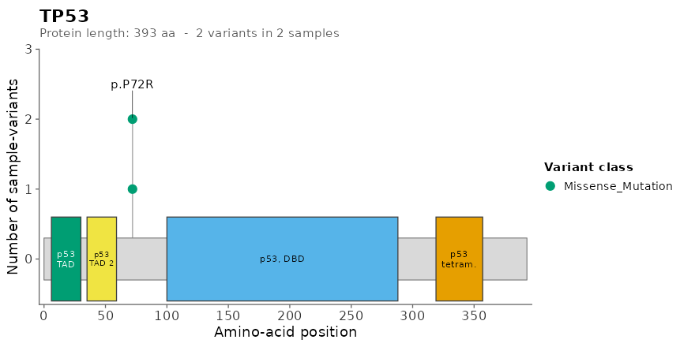

# germlinevaR 

A self-contained toolchain for single-sample germline VCFs annotated
with Ensembl VEP, SnpEff, or both — from on-disk VCF to filtered gvr
table, candidate novel variants, cohort summary, a top-genes variant
matrix, and per-gene protein-domain lollipops, all in one R session.

## Hero example

``` r

library(germlinevaR)

vcf_dir <- system.file("extdata", package = "germlinevaR")
gvr     <- read.gvr(vcf_dir)             # 62 rows x 116 cols
filt    <- gvr_filter(gvr)               # 7 rows (default thresholds)
novel   <- gvr_novel(gvr)                # 3 candidates with no rsID / no AF
summ    <- gvr_summary(filt, out_dir = tempdir())  # XLSX + PDF + HTML dashboard + 8 tables
gvr_plot(filt, top_n = 20, out_dir = tempdir())    # top-genes variant matrix (PNG)
```

## Installation

Install the development version from GitHub:

``` r

# install.packages("remotes")
remotes::install_github("FarmagenUFC/germlinevaR")
```

germlinevaR will be submitted to Bioconductor once the accompanying
manuscript is published. Once accepted, install the release version
with:

``` r

if (!require("BiocManager", quietly = TRUE))
    install.packages("BiocManager")
BiocManager::install("germlinevaR")
```

System requirements: R (\>= 4.4.0). Optional: `bgzip` from
[HTSlib](https://www.htslib.org/) is convenient for re-bgzipping VCFs
but is not required to read them.

## What it does

germlinevaR turns one or more per-sample VEP- or SnpEff-annotated VCFs
into a tabular variant `data.table` (one row per ALT allele, one
most-severe transcript per allele) using three sibling readers that
share a canonical 80-field schema and are auto-routed from the VCF
header. From there you get:

- a tunable, modular filter (`gvr_filter`) over population AF, clinical
  significance, biotype, variant classification, genotype, and panel;
- a dedicated subsetter (`gvr_novel`) for candidate novel variants (no
  rsID and no allele frequency in any catalogue);
- an 8-section cohort summary (`gvr_summary`) that optionally writes an
  Excel workbook, a multi-page PDF, and a self-contained interactive
  HTML dashboard with plotly drill-downs and DT tables;
- a ComplexHeatmap-based top-genes variant matrix (`gvr_plot`) and
  per-section standalone PNG/SVG/PDF exports (`gvr_sum_plots`);
- per-gene protein-domain lollipops (`gvr_lollipop`) with on-the-fly
  cached InterPro domain fetching;
- per-gene gene-structure (cDNA) lollipops (`gvr_genepos.plot`) with
  Ensembl REST or local GTF sources.

Cohort folders are processed in parallel with a live heartbeat. Optional
ABraOM SABE-609 allele-frequency annotation is added for Brazilian
cohorts.

## What it doesn’t do

germlinevaR does not call variants, annotate VCFs (use VEP or SnpEff
beforehand), or replace tumor/normal somatic pipelines. It is built
around the **germline single-sample** case.

## Function map

| Group | Functions |
|----|----|
| Readers | `read.gvr` (auto-routed) `read.gvr.dual` `read.gvr.snpeff` |
| Filtering | `gvr_filter` `gvr_novel` |
| Panels | `gvr_panel_genes` `gvr_list_panels` |
| Summary | `gvr_summary` `gvr_sum_plots` |
| Per-gene plots | `gvr_plot` (top-genes variant matrix) `gvr_lollipop` `gvr_genepos.plot` |
| Palette / cache | `gvr_color_palette` `gvr_list_palettes` `gvr_domain_cache_clear` |

## Top-genes variant matrix

[`gvr_plot()`](https://farmagenufc.github.io/germlinevaR/reference/gvr_plot.md)
produces a `ComplexHeatmap`-based cohort overview: each row is a gene,
each column a sample, and each cell is coloured by the most severe
variant class observed. The top bar shows per-sample variant impact
(HIGH / MODERATE / LOW / MODIFIER); the right bar shows per-gene total
burden. The figure below uses illustrative multi-sample data:


## HTML cohort dashboard

`gvr_summary(gvr, save_html = TRUE, out_dir = ".")` writes a
self-contained interactive HTML dashboard with plotly drill-downs and DT
tables. It opens with four KPI cards (total variants, samples, distinct
genes, HIGH-impact count) followed by three bar charts (top mutated
genes, variant classification, IMPACT) and a top-variants table. The
screenshot below shows a dashboard rendered from a **synthetic 8-sample
cohort** fabricated purely to demonstrate the layout; do not read
biological meaning into any specific value.


[`gvr_sum_plots()`](https://farmagenufc.github.io/germlinevaR/reference/gvr_sum_plots.md)
writes the same panels that `gvr_summary(save_html = TRUE)` embeds in
its interactive dashboard (top genes, variant classification, IMPACT,
top variants) as standalone PNGs.

The script used to fabricate the demo cohort is bundled with the package
at `inst/scripts/build_synthetic_dashboard.R` (also reachable via
`system.file("scripts", "build_synthetic_dashboard.R", package = "germlinevaR")`).

## Per-gene plots

Protein-domain lollipop (`gvr_lollipop`) and gene-structure lollipop
(`gvr_genepos.plot`) for, e.g., TP53 and BRCA1:



[`gvr_summary()`](https://farmagenufc.github.io/germlinevaR/reference/gvr_summary.md)
also writes the same panels as a multi-page PDF
(`gvr_summary(..., save_pdf = TRUE)`) if you prefer a static report.

## Documentation

- **Full vignette (HTML):** [germlinevaR
  walkthrough](https://farmagenufc.github.io/germlinevaR/articles/germlinevaR.html)

- After installing the package, open the vignette locally with:

  ``` r

  vignette("germlinevaR", package = "germlinevaR")
  ```

## Citation

Manuscript in preparation. Run `citation("germlinevaR")` for the
up-to-date record.

## License

MIT (c) 2026 Thiago Loreto Matos, Felipe Pantoja Mesquita. See
`LICENSE`.
